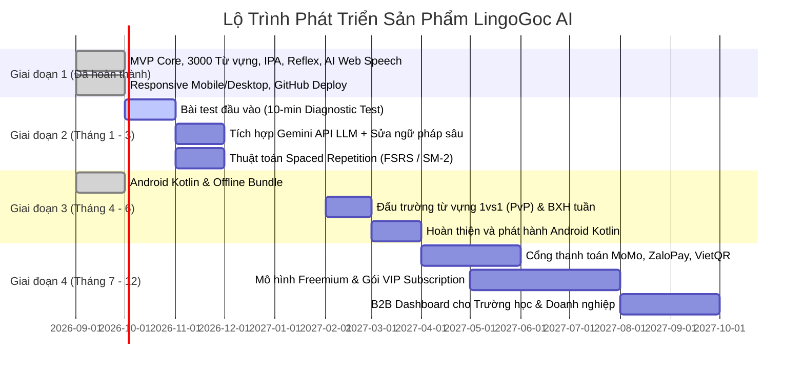

# Kế Hoạch Phát Triển Sản Phẩm Hoàn Thiện: LingoGoc AI (Product Roadmap & Strategy)

Bản chiến lược phát triển toàn diện đưa **LingoGoc AI** từ phiên bản hiện tại (MVP vững chắc với 3000 từ vựng Oxford, IPA, Mẫu câu phản xạ & Web Speech AI) trở thành một sản phẩm EdTech hoàn thiện, có khả năng mở rộng hàng triệu người dùng, đạt chuẩn thương mại và tối ưu hóa cao nhất cho **người mất gốc tiếng Anh**.

---

## 1. Tầm Nhìn & Định Vị Sản Phẩm (Vision & Value Proposition)

* **Sứ mệnh**: Trở thành ứng dụng học tiếng Anh số 1 Việt Nam dành riêng cho người mất gốc, người bận rộn và người sợ nói tiếng Anh.
* **Triết lý sản phẩm**: 
  1. *Thân thiện tối đa (Zero-friction)*: Không áp lực ngữ pháp hàn lâm, giao diện ấm áp, dùng tiếng Việt làm bệ đỡ ban đầu.
  2. *Học để nói được ngay (Micro-learning & Instant Reflex)*: Mỗi ngày chỉ cần 10-15 phút, học 1 từ là phát âm được 1 từ, học 1 khung câu là ứng dụng được vào đời thực.
  3. *AI Tutor thấu hiểu (Empathetic AI Companion)*: Bạn đồng hành luyện nói 1-1 kiên nhẫn, không phán xét, biết khích lệ và sửa lỗi phát âm tức thì.

---

## 2. Lộ Trình Phát Triển 4 Giai Đoạn (4-Phase Execution Roadmap)



---

### 📍 Giai Đoạn 1: Nền Móng MVP (ĐÃ HOÀN THÀNH 100%)
- [x] Lộ trình 4 chặng học bài bản từ IPA -> 3000 từ vựng -> 50 mẫu câu -> Phòng luyện nói AI.
- [x] Kho dữ liệu chuẩn quốc tế: 3000 từ vựng Oxford 3000 (A1 - A2 - B1) với đầy đủ IPA, nghĩa tiếng Việt, ví dụ.
- [x] 3 Chế độ học đa giác quan: Thẻ nhớ Flashcard 3D, Tra cứu danh mục, Trắc nghiệm phản xạ 4 đáp án (Quiz).
- [x] Công nghệ Web Speech API (STT thu âm qua mic, TTS giọng đọc bản xứ 0.75x & 1.0x).
- [x] Thuật toán so khớp chuỗi Levenshtein chấm điểm phát âm từng từ.
- [x] Giao diện chuẩn Responsive cho mọi màn hình (Phone, Tablet, Laptop, Desktop).
- [x] Triển khai tự động (CI/CD GitHub Actions & GitHub Pages).

---

### 📍 Giai Đoạn 2: Cá Nhân Hóa & Trí Tuệ Nhân Tạo Chuyên Sâu (Tháng 1 - 3)

#### 1. Bài Kiểm Tra Năng Lực Đầu Vào (10-Minute Diagnostic Test)
- Xây dựng bài test thông minh 10 phút gồm 3 phần:
  1. *Nghe nhận diện âm IPA* (phát hiện lỗi nuốt âm cuối, nhầm âm).
  2. *Trắc nghiệm phản xạ từ vựng* (đo quy mô vốn từ hiện tại).
  3. *Nói thử 3 câu giao tiếp* (đánh giá độ lưu loát và phát âm).
- Hệ thống tự động phân loại học viên: "Mất gốc hoàn toàn (Pre-A1)", "Biết từ nhưng không nói được (A1)", hoặc "Nói ngắc ngứ (A2)", từ đó **tự động tinh chỉnh lộ trình học riêng biệt**.

#### 2. Nâng Cấp Bộ Não AI Luyện Nói (Backend LLM Integration)
- Tích hợp mô hình ngôn ngữ lớn **Google Gemini 1.5 Flash API** qua Cloud Functions / Cloudflare Workers:
  - Cho phép người học trò chuyện **tự do không giới hạn (Free Talk)** mà không bị bó hẹp trong kịch bản cứng.
  - Phân tích lỗi sai ngữ pháp bằng tiếng Việt một cách tinh tế: *"Câu của bạn người bản xứ vẫn hiểu, nhưng để tự nhiên hơn bạn nên nói là..."*.
  - AI đóng vai gia sư Lily với tính cách kiên nhẫn, sử dụng ngữ điệu ấm áp, tích cực khích lệ.

#### 3. Thuật Toán Lặp Lại Ngắt Quãng (Spaced Repetition System - SRS)
- Triển khai thuật toán **FSRS (Free Spaced Repetition Scheduler)** hoặc **SM-2** dựa trên đường cong quên lãng Ebbinghaus.
- Hệ thống tự động tính toán thời điểm "vàng" mà não bộ sắp quên một từ vựng để đưa ra ôn tập lại trong ngày hôm đó (sau 1 ngày, 3 ngày, 7 ngày, 14 ngày, 30 ngày).

---

### 📍 Giai Đoạn 3: Đa Nền Tảng & Mạng Xã Hội Học Tập (Tháng 4 - 6)

#### 1. Ứng Dụng Android Kotlin & Offline Mode
- Đóng gói frontend và kho từ hệ thống trực tiếp trong APK bằng `WebViewAssetLoader`.
- Hỗ trợ **Học Offline** đối với nội dung đã đóng gói và tiến độ cục bộ; chức năng AI tiếp tục dùng backend khi có mạng.

#### 2. Xuất Bản Ứng Dụng Di Động Native
- Hoàn thiện ứng dụng **Android Kotlin** và nghiên cứu phiên bản iOS riêng:
  - Đưa bản Android lên Google Play Store.
  - Tích hợp thông báo đẩy (Push Notifications) nhắc nhở giữ chuỗi Streak thông minh theo khung giờ rảnh rỗi của từng người dùng.

#### 3. Tính Năng Gamification & Cộng Đồng (Social Learning)
- **Đấu Trường Từ Vựng 1vs1 (PvP Vocab Battle)**: Ghép đôi 2 người dùng ngẫu nhiên để cùng thi phản xạ từ vựng trong 60 giây.
- **Bảng Xếp Hạng Hàng Tuần (Weekly Leaderboard)**: Chia giải đấu theo các League (Đồng, Bạc, Vàng, Kim Cương, Cao Thủ) tạo động lực thi đua lành mạnh.
- **Bạn Cùng Tiến (Study Buddy)**: Nhắc nhở và gửi lời động viên tới bạn học khi chuỗi ngày có nguy cơ bị đứt.

---

### 📍 Giai Đoạn 4: Thương Mại Hóa & Hệ Sinh Thái B2B (Tháng 7 - 12)

#### 1. Mô Hình Doanh Thu Freemium
| Gói Dịch Vụ | Tính Năng | Mức Giá Dự Kiến |
| :--- | :--- | :--- |
| **Miễn Phí (Free Starter)** | - Toàn bộ Chặng 1 (IPA)<br>- 500 từ vựng cốt lõi A1<br>- 15 mẫu câu phản xạ<br>- 3 lượt trò chuyện AI mỗi ngày | **0 VNĐ** (Mãi mãi) |
| **Gói Pro (VIP Monthly)** | - Mở khóa toàn bộ 3000 từ vựng Oxford<br>- Luyện nói AI không giới hạn với mọi kịch bản<br>- Báo cáo sửa phát âm ngữ âm nâng cao<br>- Tải bài học offline | **99.000 VNĐ / tháng** |
| **Gói Trọn Đời (Lifetime)** | - Toàn bộ tính năng Pro vĩnh viễn<br>- Quyền truy cập các chủ đề tiếng Anh chuyên ngành tương lai | **599.000 VNĐ** |

#### 2. Cổng Thanh Toán Thuần Việt & Đơn Giản Hóa
- Tích hợp cổng thanh toán tự động qua mã **VietQR (Quét mã chuyển khoản ngân hàng kích hoạt ngay trong 5 giây)**.
- Hỗ trợ ví điện tử **MoMo**, **ZaloPay**, **VNPAY** và thẻ Visa/Mastercard qua Stripe.

#### 3. Dịch Vụ Doanh Nghiệp (LingoGoc for Business)
- Cung cấp Dashboard quản lý tiến độ học tiếng Anh giao tiếp cho các doanh nghiệp du lịch, nhà hàng, khách sạn và văn phòng muốn nâng cao trình độ tiếng Anh cho nhân viên.

---

## 3. Kiến Trúc Kỹ Thuật Mục Tiêu (Target System Architecture)

```
[Người Dùng: Web / Android Kotlin / iOS tương lai]
                      │
                      ▼
[Cloudflare CDN & Edge Caching / HTTPS]
                      │
        ┌─────────────┴─────────────┐
        ▼                           ▼
[Frontend: React 19 + Vite]   [API Backend: FastAPI / Node.js]
                                    │
               ┌────────────────────┼────────────────────┐
               ▼                    ▼                    ▼
     [Supabase / PostgreSQL]  [Gemini 1.5 Flash]  [Cloudflare R2 Storage]
      (Users, XP, Progress)    (Conversations &    (Pre-rendered High
                               Grammar Feedback)    Quality US/UK Audio)
```

---

## 4. Các Chỉ Số Đo Lường Hiệu Quả (KPIs & Metrics)

1. **Chỉ số Giữ chân Người dùng (Retention Rate)**:
   - D1 Retention > 50% (người dùng quay lại học vào ngày thứ 2).
   - D7 Retention > 30%, D30 Retention > 18%.
2. **Thời lượng Tương tác (Engagement)**:
   - Thời gian luyện nói trung bình: >= 12 phút / người / ngày.
   - Tỷ lệ hoàn thành ít nhất 1 bài luyện nói AI: >= 65% người dùng mới.
3. **Chỉ số Tiến bộ Học viên**:
   - Tăng điểm phát âm trung bình sau 14 ngày học: Tăng ít nhất 25%.
   - Số từ vựng thuộc trung bình: 100 từ sau tháng đầu tiên.
4. **Chỉ số Doanh thu & Chuyển đổi**:
   - Tỷ lệ chuyển đổi từ Free sang Pro: >= 3.5%.
   - Điểm số hài lòng học viên (NPS - Net Promoter Score): >= 70/100.
